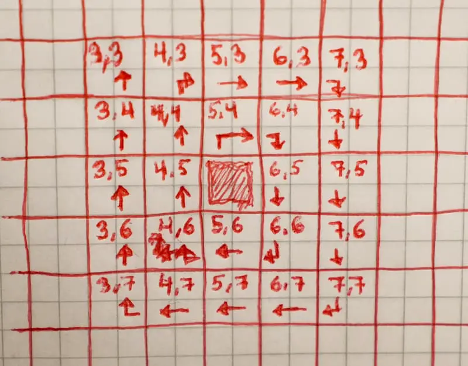

# spiral-walk

Tool for generating coordinates for spiral walking in a 2D matrix.

```js
// Use as static

SpiralWalkCoordGen.StopCondition = { maxCircles: 2 }
SpiralWalkCoordGen.StartCoord = { x: 5, y: 5 };

for (const coord of SpiralWalkCoorGen) {
    //const result = testMatrix[coord.x][coord.y] != null ? "full" : "empty"
    //console.log(coord, "The cell is " + result);
}
```

```js
// Use as instance

const generator = new SpiralWalkCoordGen();

generator.StopCondition = { maxCircles: 2 }
generator.StartCoord = { x: 5, y: 5 };

for (const coord of generator) {
    //const result = testMatrix[coord.x][coord.y] != null ? "full" : "empty"
    //console.log(coord, "The cell is " + result);
}
```
<details>
  <summary>
    outprint (both static and instance commented out code):
  </summary>
    { x: 5, y: 5 } - The cell is empty<br>
    { x: 5, y: 4 } - The cell is full <br>
    { x: 6, y: 4 } - The cell is full <br>
    { x: 6, y: 5 } - The cell is full <br>
    { x: 6, y: 6 } - The cell is empty <br>
    { x: 5, y: 6 } - The cell is empty <br>
    { x: 4, y: 6 } - The cell is full <br>
    { x: 4, y: 5 } - The cell is empty <br>
    { x: 4, y: 4 } - The cell is empty <br>
    { x: 4, y: 3 } - The cell is full <br>
    { x: 5, y: 3 } - The cell is empty <br>
    { x: 6, y: 3 } - The cell is full <br>
    { x: 7, y: 3 } - The cell is full <br>
    { x: 7, y: 4 } - The cell is full <br>
    { x: 7, y: 5 } - The cell is full <br>
    { x: 7, y: 6 } - The cell is full <br>
    { x: 7, y: 7 } - The cell is full <br>
    { x: 6, y: 7 } - The cell is empty <br>
    { x: 5, y: 7 } - The cell is empty <br>
    { x: 4, y: 7 } - The cell is empty <br>
    { x: 3, y: 7 } - The cell is empty <br>
    { x: 3, y: 6 } - The cell is full <br>
    { x: 3, y: 5 } - The cell is empty <br>
    { x: 3, y: 4 } - The cell is empty <br>
    { x: 3, y: 3 } - The cell is empty
</details>

  <br>
> [!CAUTION]
> It does not check the input. The user of this class is responsible for that it is correct.


  <br>

### Properties
Uses [destructuring assignment](https://developer.mozilla.org/en-US/docs/Web/JavaScript/Reference/Operators/Destructuring_assignment) as inputs.<br>
i.e. you do not ned to use all arguments <br>
All properties has only setters.

  <br>
**StartCoord**<br>
Can be included or excluded from the iteration output. <br>
Coord outside of border can result in no iteration output, see border.
| Argument<br>name | Default<br>value | Values |
|---|---|---|
| x | 0 | number |
| y | 0 | number |
| includeInIteration | true | boolean

```js
SpiralWalkCoordGen.StartCoord = { x: 90, y: 50 };
for (const coord of SpiralWalkCoorGen) {
    // first coord x: 90 y: 50
}

SpiralWalkCoordGen.StartCoord = { x: 100 }
for (const coord of SpiralWalkCoorGen) {
    // first coord x: 100 y: 50
}

SpiralWalkCoordGen.StartCoord = { y: 60 }
for (const coord of SpiralWalkCoorGen) {
    // first coord x: 100 y: 60
}
```

  <br>
**StopCondition**<br>
More then one condition can be active. Stops on the first to be fulfilled.<br>
No active condition should make a infinitive loop.
| Argument<br>name | Default<br>value | Values |
|---|---|---|
| maxCircles | false | number or false |
| reachedFirstBorder | false | boolean |
| reachedAllBorders | true | boolean |
| reachedIterationCount | 10000 | number or false | 

```js
SpiralWalkCoordGen.StopCondition = {
    reachedFirstBorder: true,
    reachedIterationCount: 1000000
}
```
  <br>

**Filter**

| Argument<br>name | Default<br>value | Values |
|---|---|---|
| useCustomFunc | false | boolean |
| customFunc | (x, y, startX, startY, circleNumber, leftVBorderX, <br> rightVBorderX, topHBorderY, bottomHBorderY) => { return true;} | function |

| Custom function<br>argument | |
|---|---|
| x | x value to coordinate that is tested |
| y | y value to coordinate that is tested |
| startX | x value to the coordinate that spiral started from |
| startY | y value to the coordinate that spiral started from |
| circleNumber | Tells which circle you are on, 1 is the first circle around the center |
| leftBorderX | x value for the coordinates at the left border, the smallest x value |
| rightBorderX | x value for the coordinates at the right border, the biggest x value |
| topBorderX | y value for the coordinates at the top border, the smallest y value |
| bottomBorderX | y value for the coordinates at the bottom border, the biggest y value |

```js
SpiralWalkCoordGen.Filter = {
    useCustomFunc: true,
    customFunc: (x, y, sx, sy, c, lX, rX, tY, bY) => {
        return (lX <= x && x <= rX) || (tY <= y && y <= bY)
    }
}
```

  <br>
**Border** <br>
Start coord outside of border give no iteration output if includeCoordsOutside is false, its default is false.

| Argument<br>name | Default<br>value | Values | |
|---|---|---|---|
| x | -10 | number | Upper left corner | 
| y | -10 | number | Upper left corner | 
| width | 21 | number | |
| height | 21 | number | |
| includeCoordsOutside | false | boolean | |
| leftVerticalX | -10 | number | Will be autogenerated |
| rightVerticalX | 10 | number | Will be autogenerated |
| topHorizontalY | -10 | number | Will be autogenerated |
| bottomHorizontalY | 10 | number | Will be autogenerated |
```js
SpiralWalkCoordGen.Border = {
    x: 50,
    y: 50,
    width: 100,
    height: 60
}
```

  <br>

**Walking**

| Argument<br>name | Default<br>value | Values |
|---|---|---|
| direction | "cw" | "cw" or "ccw" |
```js
SpiralWalkCoordGen.Walking = {
    direction: "ccw"
}
```


  <br>

### Functions

**Reset()**<br>
Exist only as a static function
```js
SpiralWalkCoordGen.Reset();
```