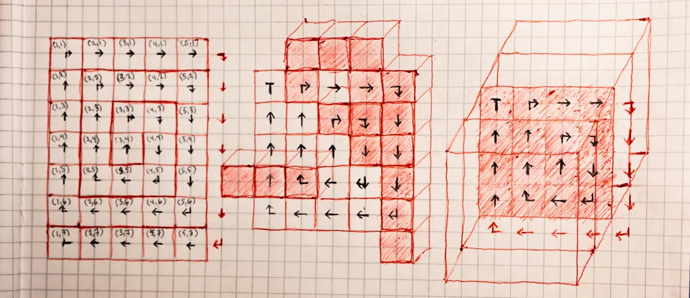

  <br>

# Spiral Walking <br> on a 2D plane in a 2D or 3D world <br> A iterator that generates coordinates


This tool let you walk outwards in a spiral from a given point in a 2D plain. The plain can be a 2D matrix or a slice (slabs with one cell thickness) of a 3d volume, or other that takes coordinates as input. 

It's made as an iterator that you use in a for...of loop, as seen in the code block below. In that example the result is a 1D list with all the elements in spiral order. 

```js
const matrixToWalkIn = [
    [ Y00, J01, K02, L03, M04 ],
    [ X10, I11, B12, C13, N14 ],
    [ W20, H21, A22, D23, O24 ],
    [ V30, G31, F32, E33, P34 ] ];

const inSpiralOrder = [];
for (const { x, y } of SpiralWalkCoordGen) {
    inSpiralOrder.push( matrixToWalkIn[ y ][ x ] );
}

_.isEqual(inSpiralOrder, [ A22, B12, C13, D23, E33, F32, G31, H21, I11, J01, K02, L03, M04, N14, O24, P34, V30, W20, X10, Y00 ]) == true;
```

  <br>

> [!NOTE]  
> It's implemented as vanilla javascript class in a [ECMAscript module](https://developer.mozilla.org/en-US/docs/Web/JavaScript/Guide/Modules). 
> The module is in its most simple form, just remove the `export` key in front of the class definition to use it as a regular class. <br>
> All inputs and outputs to this class follows the [destructuring assignment](https://developer.mozilla.org/en-US/docs/Web/JavaScript/Reference/Operators/Destructuring_assignment) syntax

  <br>

```js
// How to use as static

SpiralWalkCoordGen.StopCondition = { maxCircles: 2 }
SpiralWalkCoordGen.StartCoord = { x: 5, y: 5 };

for (const coord of SpiralWalkCoordGen) {
    const result = testMatrix[coord.x][coord.y] != null ? "full" : "empty"
    console.log(coord, "The cell is " + result);
}
```

```js
// How to use as instance

const generator = new SpiralWalkCoordGen();

generator.StopCondition = { maxCircles: 2 }
generator.StartCoord = { x: 5, y: 5 };

for (const coord of generator) {
    const result = testMatrix[coord.x][coord.y] != null ? "full" : "empty"
    console.log(coord, "The cell is " + result);
}
```
<details>
  <summary>
    outprint:
  </summary>
    { x: 5, y: 5 } - The cell is empty<br>
    { x: 5, y: 4 } - The cell is full <br>
    { x: 6, y: 4 } - The cell is full <br>
    { x: 6, y: 5 } - The cell is full <br>
    { x: 6, y: 6 } - The cell is empty <br>
    { x: 5, y: 6 } - The cell is empty <br>
    { x: 4, y: 6 } - The cell is full <br>
    { x: 4, y: 5 } - The cell is empty <br>
    { x: 4, y: 4 } - The cell is empty <br>
    { x: 4, y: 3 } - The cell is full <br>
    { x: 5, y: 3 } - The cell is empty <br>
    { x: 6, y: 3 } - The cell is full <br>
    { x: 7, y: 3 } - The cell is full <br>
    { x: 7, y: 4 } - The cell is full <br>
    { x: 7, y: 5 } - The cell is full <br>
    { x: 7, y: 6 } - The cell is full <br>
    { x: 7, y: 7 } - The cell is full <br>
    { x: 6, y: 7 } - The cell is empty <br>
    { x: 5, y: 7 } - The cell is empty <br>
    { x: 4, y: 7 } - The cell is empty <br>
    { x: 3, y: 7 } - The cell is empty <br>
    { x: 3, y: 6 } - The cell is full <br>
    { x: 3, y: 5 } - The cell is empty <br>
    { x: 3, y: 4 } - The cell is empty <br>
    { x: 3, y: 3 } - The cell is empty
</details>


  <br>


### Iteration Algorithm (Simplified)

```js
while ("Should walk one more circle") {
    for ( "Traverse top row" )
        "new coordinate"
    for ( "Traverse most right column" )
        "new coordinate"
    for ( "Traverse bottom row" )
        "new coordinate"
    for ( "Traverse most left column" )
        "new coordinate"
}
```

This is the spiral walk algorithm. It is one while loop and four for loops, the first do-while in the code below is not a part of the circle walk but for moving to the next plain and thus move through a volume. The while loop that is a part of the walk algorithm decides how many circle there should be, while the for loops is for traversing one of the four sides of the circle. See fig.A. 

Notice that the traversing starts on the second square, while in the code the X,Y and Z is set on the upper left corner. So the first to do in the for loop is to shift one square, that is whey starting with increase or decrease the axes that are traversed. waiting with increase or decrease to after generated the coordinate will end up as seen in fig.B. Notice also that length of a side that they traverse is circle number multiplied with 2. 

> [!NOTE]  
> In order to keep it simple `planeCount` is here zero based (counts from 0), 
> while `planeCount` that are coming in to the custom function is one based (counts from 1).

```js
*[Symbol.iterator]() {

    planeCount = -1

    do {

        planeCount++
        circleCount = 0

        if (includeStartCoord) {
            yield { x: startCoord.x, y: startCoord.y, 
                        z: startCoord.z + planeCount }
        }

        while (ShouldWalkOneMoreCircle()) {

            circleCount++
            sideLength = circleCount * 2
            X = startCoord.x - circleCount
            Y = startCoord.y - circleCount
            Z = startCoord.z + planeCount

            for (hTop = 0; hTop < sideLength; hTop++) {
                X++
                if (includeCoordinate( X, Y )) {
                    yield { x: X, y: Y, z: Z }
                }
            }
            for (vRight = 0; vRight < sideLength; vRight++) {
                Y++
                if (includeCoordinate( X, Y )) {
                    yield { x: X, y: Y, z: Z}
                }
            }
            for (hBottom = 0; hBottom < sideLength; hBottom++) {
                X--
                if (includeCoordinate( X, Y )) {
                    yield { x: X, y: Y, z: Z }
                }
            }
            for (vLeft = 0; vLeft < sideLength; vLeft++) {
                Y--
                if (includeCoordinate( X, Y)) {
                    yield {x: X, y: Y, z: Z }
                }
            }
        }

    }
    while (ShouldGoToNextPlane())
}
```


  <br>

### Properties
All uses [destructuring assignment](https://developer.mozilla.org/en-US/docs/Web/JavaScript/Reference/Operators/Destructuring_assignment) as inputs and outputs.
i.e. you do not ned to use all arguments <br>
All properties has only setters, so the only output is the iterator and the arguments that goes into the custom function.


  <br>
> [!NOTE]  
> The properties exist as both static properties and as instance properties.
> All examples works also when using it as a instance.

> [!CAUTION]
> It does not check the input. The user of this class is responsible for that it is correct.

  <br>
**StartCoord**<br>
Is the center and starting point for the spiral.

> [!NOTE]  
> Coord outside of border can result in no iteration output.<br>
> A delta less then 1 can result in the same coordinates. x = 1.9 gives the value 1, adding dx = 0.2 gives the value 2, adding dx again gives the value 2 one more time.

| Argument<br>name | Default<br>value | Values | |
|---|---|---|---|
| x | 0.00 | number | |
| y | 0.00 | number | |
| z | 0.00 | number | Only used in volume mode |
| dx | 0.00 | number | Shifts the x coordinate after has ended the circle |
| dy | 0.00 | number | As dx but for the y coordinate |
| dz | 0.00 | number | As dx but for the z coordinate. Only used in volume mode
| increaseAfter | false | boolean | |
| includeInIteration | true | boolean | Start with the center or the first circle.

```js
SpiralWalkCoordGen.StartCoord = { x: 90, y: 50 };
for (const coord of SpiralWalkCoordGen) {
    // first coord x: 90 y: 50
}

SpiralWalkCoordGen.StartCoord = { x: 100 }
for (const coord of SpiralWalkCoordGen) {
    // first coord x: 100 y: 50
}

SpiralWalkCoordGen.StartCoord = { y: 60 }
for (const coord of SpiralWalkCoorGen) {
    // first coord x: 100 y: 60
}
```
```js

```
  <br>

**VolumeMode**<br>
If enabled the walk will be on a 2d plain inside of a 3d volume.

| Argument<br>name | Default<br>value | Values |
|---|---|---|
| enabled | false | boolean |
| iterateOverPlan | "xy" | "xy", "xz" or "yz" |

```js
SpiralWalkCoordGen.VolumeMode = {
    enabled: true,
    iterateOverPlan: "xz"
};

for (const coord of SpiralWalkCoorGen) {
    console.log(coord);
}
```
<details>
  <summary>
    outprint:
  </summary>
    { x: 0, y: 0, z: 0 }<br>
    { x: 0, y: 0, z: -1 }<br>
    { x: 1, y: 0, z: -1 }<br>
    { x: 1, y: 0, z: 0 }<br>
    { x: 1, y: 0, z: 1 }<br>
    { x: 0, y: 0, z: 1 }<br>
    { x: -1, y: 0, z: 1 }<br>
    { x: -1, y: 0, z: 0 }<br>
    { x: -1, y: 0, z: -1 }<br>
    { x: -1, y: 0, z: -2 }<br>
    { x: 0, y: 0, z: -2 }<br>
    { x: 1, y: 0, z: -2 }<br>
    { x: 2, y: 0, z: -2 }<br>
    { x: 2, y: 0, z: -1 }<br>
    { x: 2, y: 0, z: 0 }<br>
    { x: 2, y: 0, z: 1 }<br>
    { x: 2, y: 0, z: 2 }<br>
</details>

  <br>
**StopCondition**<br>
More then one condition can be active. Stops on the first to be fulfilled.<br>
No active condition should make a infinitive loop. _reachedIterationCount_ that is not reachable can also give infinitive loop, _includeCoordsOutside_ on border can give that problem if it is set to false.

> [!WARNING]  
> This can give a infinity loop if not set correctly.

| Argument<br>name | Default<br>value | Values |
|---|---|---|
| maxCircles | false | number or false |
| reachedFirstBorder | false | boolean |
| reachedAllBorders | true | boolean |
| reachedIterationCount | 10000 | number or false | 

```js
SpiralWalkCoordGen.StopCondition = {
    reachedFirstBorder: true,
    reachedIterationCount: 1000000
}
```
  <br>

**Filter**

Function input come as [destructuring assignment](https://developer.mozilla.org/en-US/docs/Web/JavaScript/Reference/Operators/Destructuring_assignment).

| Argument<br>name | Default<br>value | Values |
|---|---|---|
| useCustomFunc | false | boolean |
| customFunc | `() => true` | function |

| Custom function<br>argument | contains | |
|---|---|---|
| coord | {x, y, z} | The coordinate that is tested, in matrix/volume coords|
| planeCoord | {a, b} | The coordinate on the plane, identical with x and y in coord if it is in the xy plane.
| startCoord | {x, y, z} | The coordinate where the walk started |
| circleNumber | number | Tells which circle you are on, 1 is the first circle around the center |
| planeNumber | number | Tells which plane it walks on, 1 is the first plane |
| borderX | {min, max} | The smallest and biggest x value on the border.
| borderY | {min, max} | The smallest and biggest y value on the border.
| borderZ | {min, max} | The smallest and biggest z value on the border.


```js
SpiralWalkCoordGen.Filter = {
    useCustomFunc: true,
    customFunc: ({coord: {x: point}, borderX: {min, max}}) => {
        return min <= point && point <= max;
    }
}
```
<details>
  <summary>
    From a unit test where using this function:
  </summary>
  The values are the indexes. The border is 7x7. includeCoordsOutside is set to true.<br>
  
</details>

  <br>
**Border** <br>
Start coord outside of border give no iteration output if includeCoordsOutside is false, its default is false.

| Argument<br>name | Default<br>value | Values | |
|---|---|---|---|
| x | -10 | number | Upper left corner | 
| y | -10 | number | Upper left corner | 
| z | -10 | number | Upper left corner | 
| width | 21 | number | |
| height | 21 | number | |
| depth | 21 | number | |
| includeCoordsOutside | false | boolean | |
| leftPlaneMinX | -10 | number | Will be autogenerated |
| rightPlaneMaxX | 10 | number | Will be autogenerated |
| topPlaneMinY | -10 | number | Will be autogenerated |
| bottomPlaneMaxY | 10 | number | Will be autogenerated |
| frontPlaneMinZ | -10 | number | Will be autogenerated |
| backPlaneMaxZ | 10 | number | Will be autogenerated |
```js
SpiralWalkCoordGen.Border = {
    x: 50,
    y: 50,
    width: 100,
    height: 60
}
```

  <br>

**Walking**

| Argument<br>name | Default<br>value | Values |
|---|---|---|
| direction | "cw" | "cw" or "ccw" |
```js
SpiralWalkCoordGen.Walking = {
    direction: "ccw"
}
```


  <br>

### Functions

**Reset()**<br>
Exist only as a static function
```js
SpiralWalkCoordGen.Reset();
```

  <br>

### Performance

Optimization hasn't received much focus. Still, I don't think there will be any issues in most cases since a unit test generating a 10 million long spiral executes in about 0.7s on a M2 MacBook Air

  <br>


The numbers are the indexes for the generated output.

